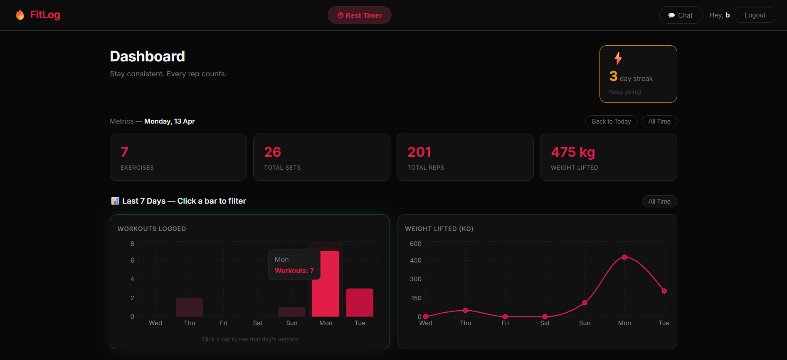
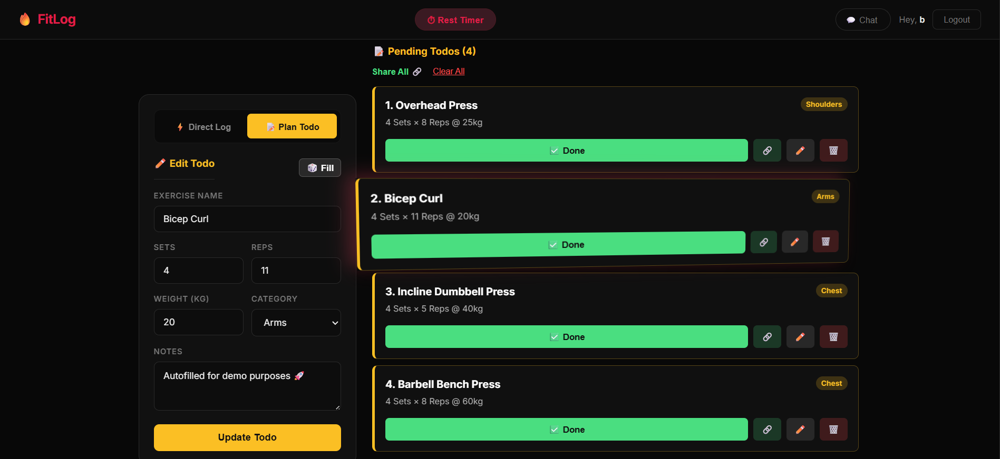
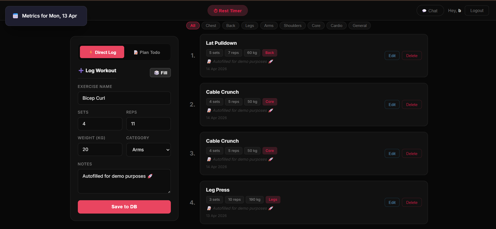
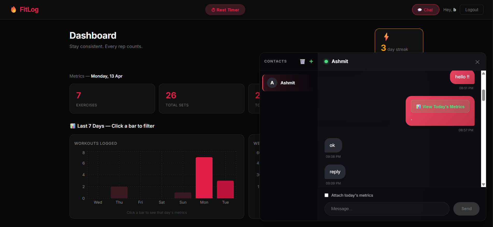
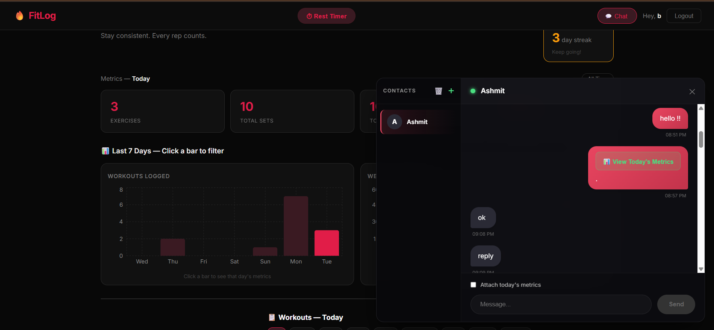
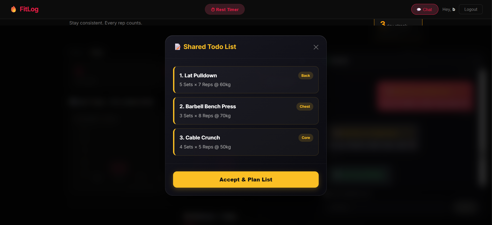
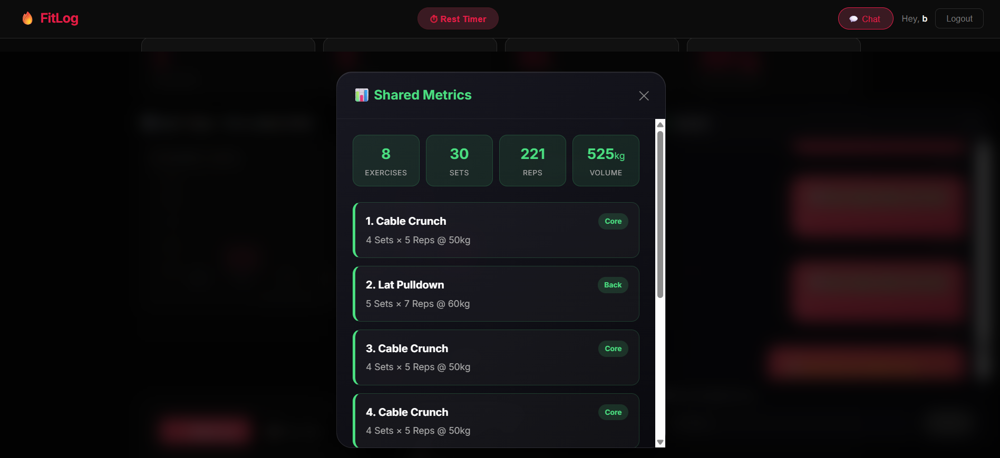
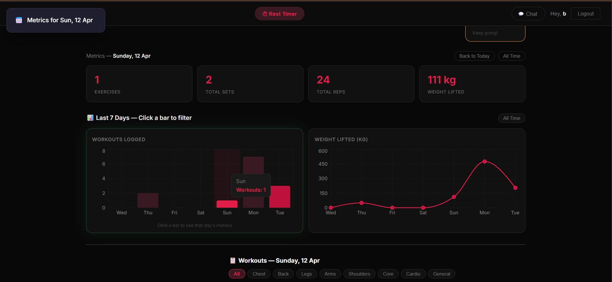
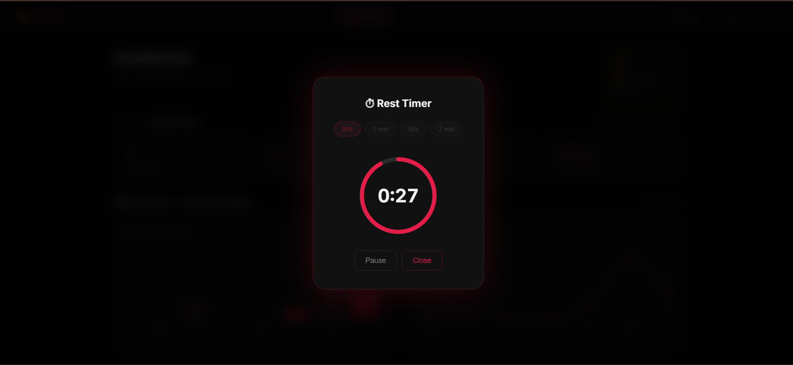

<div align="center">

# 🔥 FitLog

### A full-stack MERN workout tracker with real-time chat, Google OAuth, and live analytics

<br/>

[](https://react.dev)
[](https://nodejs.org)
[](https://expressjs.com)
[](https://mongodb.com)
[](https://socket.io)









<br/>

> Built with the **MERN stack**.  
> Features real auth, real-time chat, interactive charts, and a workout sharing system built in chat.

</div>

---

## ✨ Features at a Glance

| Feature | Description |
|---|---|
| 🔐 **JWT Auth** | Secure signup/login with hashed passwords (bcryptjs) |
| 🌐 **Google OAuth** | One-click login via Passport.js + Google Cloud |
| 💬 **Real-time PT Chat** | Socket.io chat with contacts sidebar, persisted in MongoDB |
| 📊 **Interactive Charts** | Click any bar to filter dashboard metrics by day (Recharts) |
| 📝 **Workout Planner** | Dual-mode form — log directly to DB or plan a local todo list |
| 🔗 **Share Workouts** | Send entire workout plans as interactive data pills in chat |
| ⏱ **Rest Timer** | Full-screen blur overlay with animated SVG countdown ring |
| 🔥 **Streak Counter** | Consecutive-day streak with fire animation at 7+ days |
| 🔔 **Toast Notifications** | react-hot-toast with custom premium styles |
| 📱 **Responsive** | Works on mobile and desktop |

---

## 🛠 Tech Stack

### Backend
- **Node.js** + **Express** — REST API server
- **MongoDB** + **Mongoose** — database and ODM
- **Socket.io** — real-time bidirectional chat
- **JWT** (jsonwebtoken) — stateless auth tokens
- **bcryptjs** — password hashing
- **Passport.js** + **passport-google-oauth20** — Google OAuth strategy

### Frontend
- **React 18** (Vite) — component-based UI
- **React Router v6** — client-side routing with protected routes
- **Axios** — HTTP client for REST calls
- **Socket.io-client** — connects to backend socket
- **Recharts** — bar + line charts with click-to-filter
- **react-hot-toast** — dismissable notification toasts
- **Context API** — global state for auth, socket, and timer

---

## 📁 Project Structure

```
workout-tracker/
│
├── install.sh               ← One-time setup script
├── package.json             ← Root: npm run dev starts both servers
│
├── backend/
│   ├── server.js            ← Entry point: Express + Socket.io
│   ├── .env.example         ← Environment variable template
│   │
│   ├── config/
│   │   ├── db.js            ← MongoDB connection via Mongoose
│   │   └── passport.js      ← Google OAuth strategy
│   │
│   ├── models/
│   │   ├── User.js          ← User schema (email, password?, googleId?)
│   │   ├── Workout.js       ← Workout schema (linked to user by ObjectId)
│   │   └── Message.js       ← Chat message schema (workoutSnapshot + workoutTodo)
│   │
│   ├── controllers/
│   │   ├── authController.js     ← signup(), login() — returns JWT + _id
│   │   ├── workoutController.js  ← getWorkouts, addWorkout, deleteWorkout, updateWorkout
│   │   └── chatController.js     ← findUser (by email), getHistory (between two users)
│   │
│   ├── middleware/
│   │   └── authMiddleware.js     ← protect() — validates JWT on every request
│   │
│   └── routes/
│       ├── auth.js          ← /api/auth/signup|login|google|callback
│       ├── workouts.js      ← /api/workouts (CRUD, all protected)
│       └── chat.js          ← /api/chat/find-user, /api/chat/history/:id
│
└── frontend/src/
    ├── App.jsx              ← Providers, BrowserRouter, RestTimerOverlay, Toaster
    ├── main.jsx             ← ReactDOM.createRoot → mounts App
    ├── index.css            ← Red/black gym theme + animations
    │
    ├── context/
    │   ├── AuthContext.jsx  ← user, login(), logout() — localStorage persistence
    │   ├── SocketContext.jsx ← socket (useState), unreadCount, clearNotifications()
    │   └── TimerContext.jsx ← isOpen, openTimer(), closeTimer()
    │
    ├── pages/
    │   ├── LoginPage.jsx    ← Email/password form + Google OAuth button
    │   ├── SignupPage.jsx   ← Registration form
    │   └── HomePage.jsx     ← Dashboard: stats → charts → CRUD + todo system
    │
    └── components/
        ├── Navbar.jsx             ← Brand, Rest Timer btn, PT Chat btn + badge
        ├── RestTimerOverlay.jsx   ← Full-screen blur + SVG countdown ring
        ├── ChartsSection.jsx      ← 7-day bar + line charts, clickable bars
        ├── StreakBadge.jsx        ← Streak counter with fire animation (UTC-safe)
        ├── TiltCard.jsx           ← 3D tilt wrapper (pure CSS transforms)
        ├── WorkoutForm.jsx        ← Dual-mode: Direct Log vs Plan Todo
        ├── WorkoutCard.jsx        ← Single workout card: Edit + Delete
        ├── EditModal.jsx          ← Pre-filled edit modal (PATCH)
        └── ChatBox.jsx            ← PT chat: contacts, data pills, share modal
```

---

## 🚀 Getting Started

### Prerequisites

- [Node.js v18+](https://nodejs.org)
- [MongoDB Community](https://www.mongodb.com/try/download/community) (running locally)
- [Git](https://git-scm.com)

### 1 — Clone and install

```bash
git clone https://github.com/your-username/fitlog.git
cd fitlog

# Install everything in one command
bash install.sh
```

Or manually:

```bash
cd backend  && npm install
cd ../frontend && npm install
```

### 2 — Environment variables

```bash
cd backend
cp .env.example .env
```

Open `backend/.env` and fill in:

```env
PORT=5000
MONGO_URI=mongodb://localhost:27017/fitlog
JWT_SECRET=pick_any_long_random_string

# Optional — needed only for Google OAuth
GOOGLE_CLIENT_ID=your_client_id_from_google_console
GOOGLE_CLIENT_SECRET=your_client_secret
```

### 3 — Run

```bash
# From the root folder — starts BOTH servers simultaneously
npm run dev
```

Or in two separate terminals:

```bash
# Terminal 1
cd backend && npm run dev

# Terminal 2
cd frontend && npm run dev
```

Open **http://localhost:5173**

---

## 🔐 Google OAuth Setup (Optional)

1. Go to [console.cloud.google.com](https://console.cloud.google.com)
2. Create a project → **APIs & Services** → **OAuth consent screen** → External
3. **Credentials** → Create → **OAuth 2.0 Client ID** → Web application
4. Add authorized redirect URI: `http://localhost:5000/api/auth/google/callback`
5. Copy the Client ID and Secret into your `.env` file

---

## 📡 API Endpoints

### Auth
| Method | Endpoint | Description |
|---|---|---|
| POST | `/api/auth/signup` | Register with email + password |
| POST | `/api/auth/login` | Login, returns JWT |
| GET | `/api/auth/google` | Redirect to Google OAuth |
| GET | `/api/auth/google/callback` | Google callback → redirects to `/auth?token=...` |

### Workouts *(all require `Authorization: Bearer <token>` header)*
| Method | Endpoint | Description |
|---|---|---|
| GET | `/api/workouts` | Get all workouts for logged-in user |
| POST | `/api/workouts` | Add a new workout |
| PATCH | `/api/workouts/:id` | Update a workout |
| DELETE | `/api/workouts/:id` | Delete a workout |

### Chat *(protected)*
| Method | Endpoint | Description |
|---|---|---|
| GET | `/api/chat/find-user?email=` | Find a user by email |
| GET | `/api/chat/history/:userId` | Get message history between two users |

### Socket.io Events
| Event (emit) | Payload | Description |
|---|---|---|
| `join_room` | `userId` | Join personal message room |
| `send_message` | `{fromUserId, toUserId, text, workoutSnapshot}` | Send a message |

| Event (listen) | Description |
|---|---|
| `receive_message` | Incoming message from another user |
| `message_sent` | Confirmation that your message was saved |

---

## 💡 Feature Highlights

### Real-time Chat
The chat uses Socket.io for instant delivery. Each user joins a room named after their MongoDB `_id`. When a message is sent, the server saves it to MongoDB first, then emits it to the recipient's room. This ensures messages persist across refreshes.


### Data Pills
When a workout plan is shared via chat, it's encoded as a JSON string inside the `workoutSnapshot` field. The receiving client detects and parses this, rendering it as a clickable "View Plan (4 exercises)" button rather than raw JSON text.



### Clickable Charts
The bar chart (Recharts `BarChart`) uses the `onClick` prop on each `<Bar>` to call `onDaySelect(barData.key)`. This updates `selectedDay` state in `HomePage`, which filters both the stat cards and the workout list to show only that day's data.


### Rest Timer
The timer state (`isOpen`) lives in `TimerContext` — a global context. `RestTimerOverlay` is rendered as a sibling of the blurred page wrapper in `App.jsx`, so it appears clearly above the blur. The countdown uses `setInterval` inside a `useEffect`, with a `useRef` to store the interval ID for reliable cleanup.


---

## 🎓 About This Project

- Full-stack JavaScript development
- RESTful API design with Express
- MongoDB document modeling and relationships
- Real-time communication with Socket.io
- OAuth 2.0 authentication flow
- React state management with Context API
- Component-driven architecture